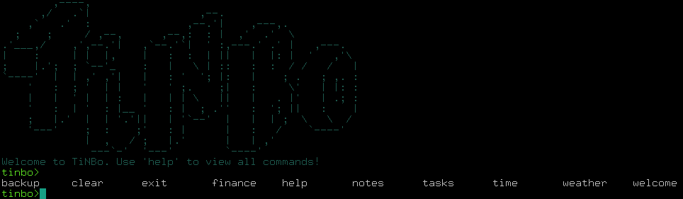
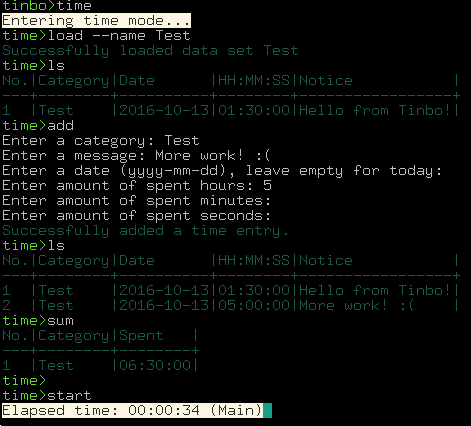
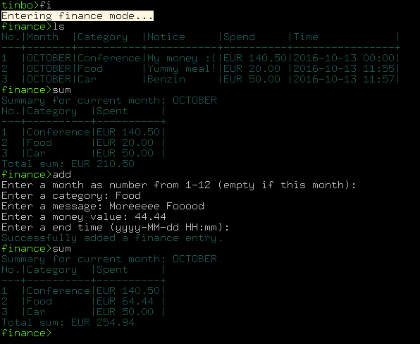

# TiNBo

Ti(me)N(otes)B(urndown)o(mni - lat. everything) is a tool with the aim to 
support many different kinds of trackings. From note and task taking to time
tracking and finance checking, everything should work fast and easy through 
a shell like experience. 



Development at `https://gitlab.com/arturbosch/Tinbo`
Mirror at `https://github.com/arturbosch/TiNBo`

# Build

Download from bintray `https://bintray.com/arturbosch/software/TiNBo/`
or run `gradle clean build` to build a executable jar.

Current version is [M7](https://bintray.com/arturbosch/software/TiNBo/M7#files)
# Features

### General

- Easy to use through the terminal
- Developed with 'i3 power user' in mind
- No database overhead, saves as csv, easy to modify out of tinbo

### Time mode

- start/stop timers
- add categories and messages
- list, filter and sum time entries
- choose between fore- and background
- week summaries



### Notes/Tasks mode

- add, edit, delete, list notes/tasks
- filter tasks, specify categories, descriptions, start/end times and locations

### Finance mode

- add, delete, list expenditure per month and categories
- year for year summaries
- sum, mean, deviation commands



# Plugins

M7 introduces an API which supports plugins. Follow this five steps guide 
to create your own plugins:

1. Create a new project with plugin-api as dependency (Take a look at tinbo-lloc-plugin for a gradle project).
2. Create a class and extend TiNBoPlugin (e.g. `class LLOC : TiNBoPlugin { ... }`)
3. Write your shell commands! (e.g. ``` @CliCommand("hello")
                                       	fun execute(): String {
                                       		return "Hello World"
                                       	}
                                       	```
4. Create a file `io.gitlab.arturbosch.tinbo.plugins` in `resources/META-INF/services`
and write down your fully qualified plugin names. (e.g. `io.gitlab.arturbosch.tinbo.lloc.LLOC`)
5. Package up your plugin as a jar in the TiNBo/plugins folder and enjoy Tinbo!

PS: If you use external dependency make sure to package them too. (e.g. with gradle: 
`jar { from { configurations.compile.collect { it.isDirectory() ? it : zipTree(it) } } }`)
PS2: Mark your Kotlin/Tinbo dependency as provided/compileOnly for smaller jar files!
```groovy
dependencies {
	compileOnly project(":plugin-api")
	compile 'io.gitlab.arturbosch:lloc:1.4'
	compileOnly "org.jetbrains.kotlin:kotlin-stdlib:$kotlin_version"
}
```
PS3: If your using maven for plugin development, run `gradle publishToMavenLocal` in plugin-api folder first.                                                                      

# Todos

### General

- Support diagrams and graphs, maybe trees for visualization

### Timer
- <s>Provide Categories and messages</s>
- <s>list all finished timings</s>
- <s>sum timings per category</s>
- <s>show notifications after specific amount of time</s>

### Notes
- <s>add, delete, edit notes</s>
- <s>list notes (categorization)</s>

### BurnDown-Tracker

- Week/Month overviews for trackers
- Other useful overviews

### Finances

- <s>Support expenditure</s>
- <s>Year summaries</s>

### PSP-Tasks and Earned-Value-Tracking

- support task and time management part of psp

### Plugins

- <s>Implement basic support for plugins via ServiceLoader</s>
- Allow plugins as kotlin/groovy commands in the tinbo directory 

# Changelog
### 1.0.M1

- initial release
- list, add, edit, delete notes/tasks
- start/stop timers
- csv data storage

### 1.0.M2

#### New features
- sum time entries by categories
- allow altering timers after stopping them via console input
- plus nine more enhancements/fixes, see https://gitlab.com/ArtiSmarti/Tinbo/milestones/2

### 1.0.M3

- defaults and configurations
- startup performance

### 1.0.M4

- divided help
- pause timers

### 1.0.M5

- support expenditure and various summaries

### 1.0.M6

- small enhancements and convenience commands
- baseline to support plugins
- backup commands (local, remote -> https://gitlab.com/arturbosch/TinboServer)

### 1.0.M7

- Support plugins via ServiceLoader Api (see tinbo-lloc-plugin for sample implementation)
- Week summaries for time mode